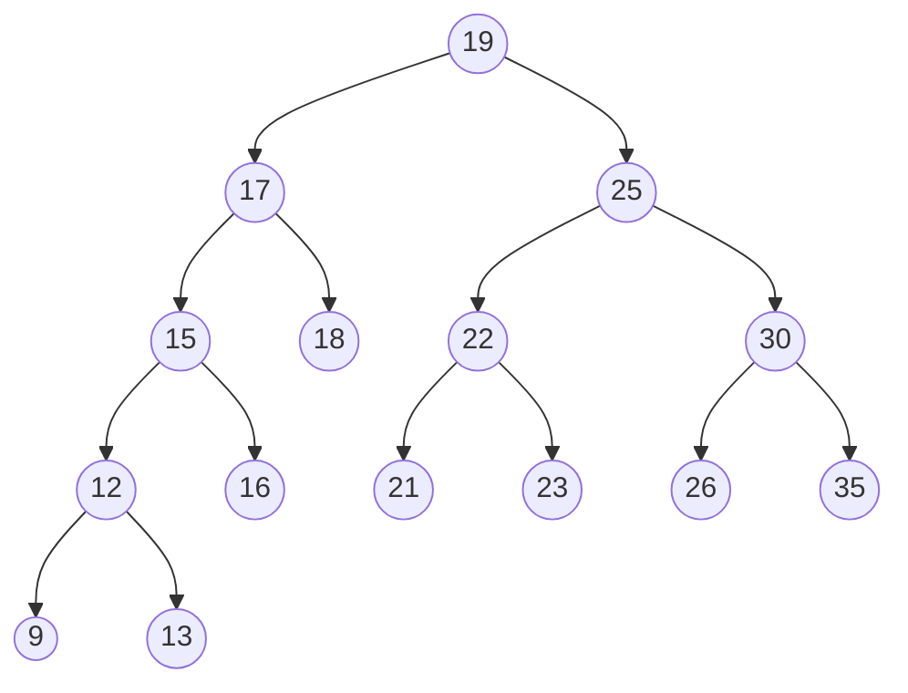

```mermaid
graph TB
    CA((19))
        CA-->CB((17))
        CA-->CC((25))
            CB-->CD((15))
            CB-->CE((18))
            CC-->CF((22))
            CC-->CG((30))
                CD-->CH((12))
                CD-->C1((16))
                CF-->CI((21))
                CF-->C2((23))
                CG-->CJ((26))
                CG-->C3((35))
                    CH-->C4((9))
                    CH-->CK((13))
    
```
