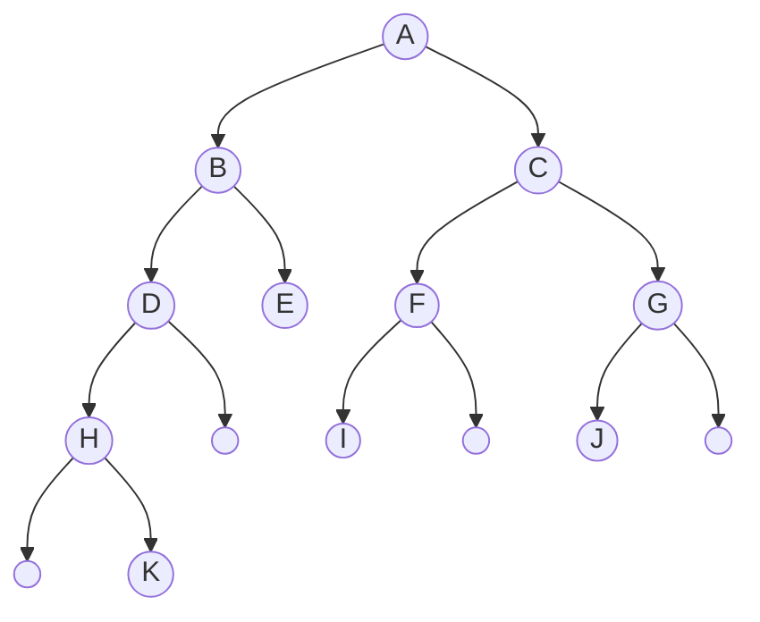

```mermaid
graph TB
    CA((A))
        CA-->CB((B))
        CA-->CC((C))
            CB-->CD((D))
            CB-->CE((E))
            CC-->CF((F))
            CC-->CG((G))
                CD-->CH((H))
                CD-->C1(( ))
                CF-->CI((I))
                CF-->C2(( ))
                CG-->CJ((J))
                CG-->C3(( ))
                    CH-->C4(( ))
                    CH-->CK((K))
    
```